# ansible-confluence

An ansible playbook for installing and configuring confluence

Example run: `ansible-playbook confluence.yml --ask-vault-pass`

## Assumptions
This playbook is tested on a fresh Ubuntu 16.04 sever install.

Defaults:
  - username: ubuntu
  - package_mgnt apt
  - hostsfile: hosts
  - database: postgres

Files you need to look at and most likely edit
  - `hosts` - check the IP address matches your desination
  - `confluence.yml`
      - update the binary file name
      - update the URL to where the above file is found
      - Ansible Vault is needed to unlock and use the postgress password.  

### Actions
This playbook installs confluence. The process is not fully automated. You will need to do the following things:  
1. Grab a backup of the current confluence system (See the five (5) backup steps below)  
2. Set up a server, installing ubuntu 16.04, then run this playbook.  
3. Browse the server `http://<ip_address:8090` and perform the post install steps below  
4. ssh into the server and do these steps:  
   1. This playbook installs confluence in **/opt/atlassian/**, so start confluence like this:  
      `sudo ./opt/atlassian/confluence/bin/start-confluence.sh`  
   2. Set the path, in our case we want to use *** "/wiki"  *** Example:  **https://alta3.com/wiki**  
      `sudo vim /opt/atlassian/confluence/conf/server.xml` and edit `context path=` to be `"/wiki"`:

             `<context path="/wiki" docBase="../confluence" debug="0" reloadable'"false" useHttpOnly="true">`
             
   3. edit the `confluence.cfg.xml` file
      `sudo vim /var/atlassian/application-data/confluence/confluence.cfg.xml` and Look for this line and add `/wiki` as follows:

              `<property name="confluence.webapp.context.path">/wiki</property>`
   4. `sudo su` to becomre root
   
   5. `crontab -e` and select vim, to create a cron job as root
   
   6. Add this line of code to the crontab: 
       `@reboot ./opt/atlassian/confluence/bin/start-confluence.sh`
## TODO
Things we'd like to add
 * add backup management to the cron  

# Backup process from old server
### Backup step 1
Log into confluence as **admin** and click here  
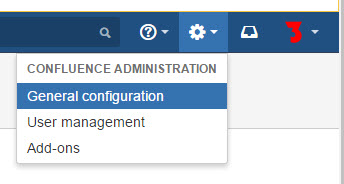

### Backup step 2
Scroll down to near the bottom of the screen, and on the left nav bar, click Backup &  Restore  
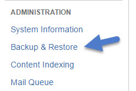

### Backup step 3
Make sure "Back up attachments is checked and click the Back Up button  
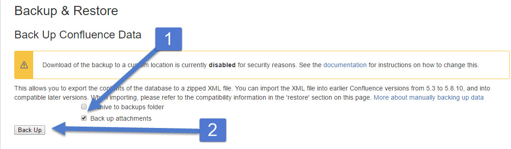

### Backup step 4
In about 10 to 15 seconds, you will be told where you backup is waiting for you.  
Before you ask, NO, it does not download to your browser!  That would be way to easy.  
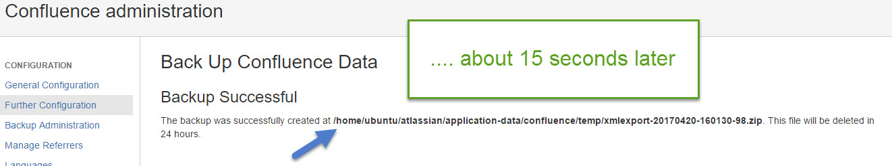

SCP into the server and grab a copy of that file. Here is a screen shot of the deed being done with winSCP.  
### Backup step 5
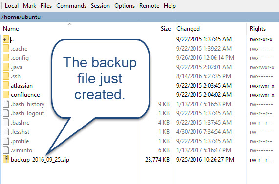

# Post Intallation Process  
### Setup step 1 Select Production installation  
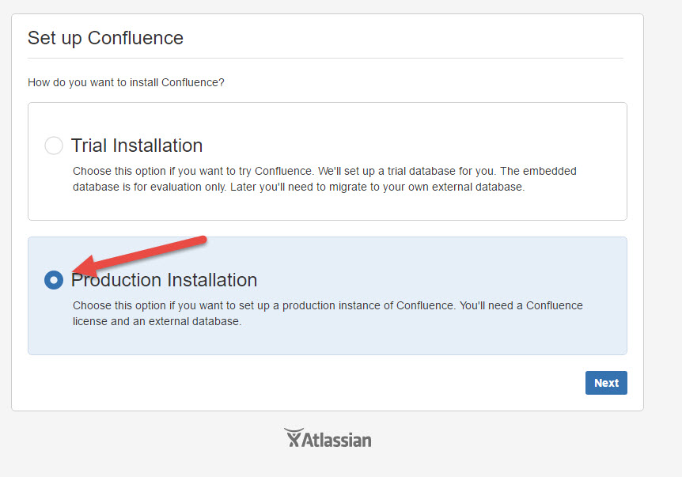  

### Setup step 2 Select Direct JDBC  
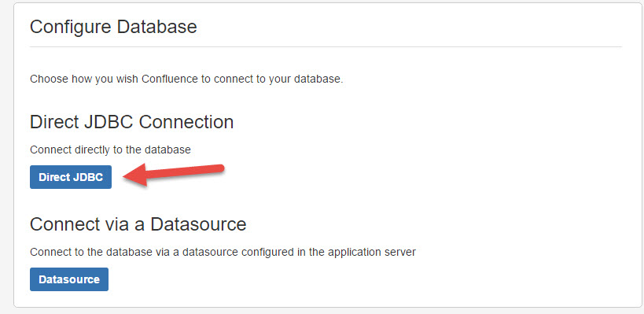  

### Setup step 3 Select Postgres as the External Database  
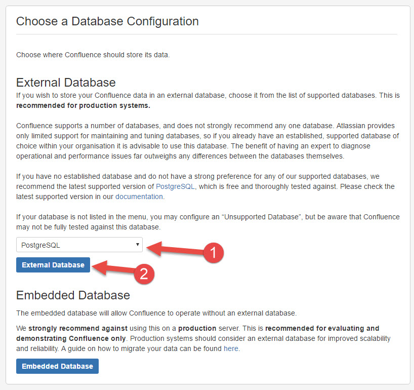  

### Setup step 4 Set up Postgres user and password  
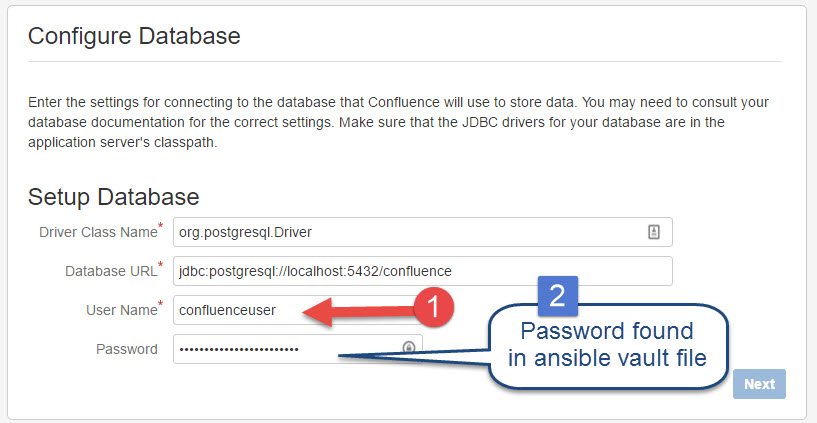  

### Setup step 5 Request restore from backup  
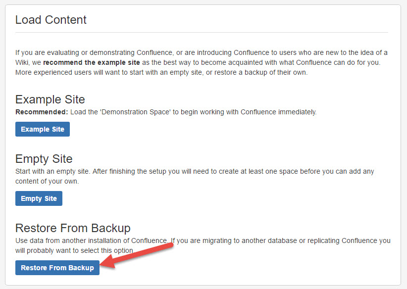  

### Setup step 6 Drop the backup file on the browser and this will appear  
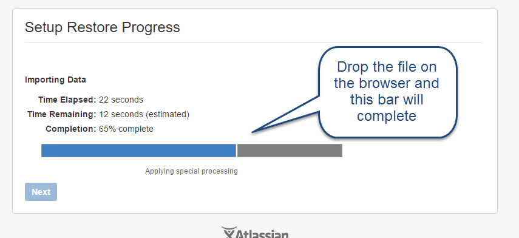  
